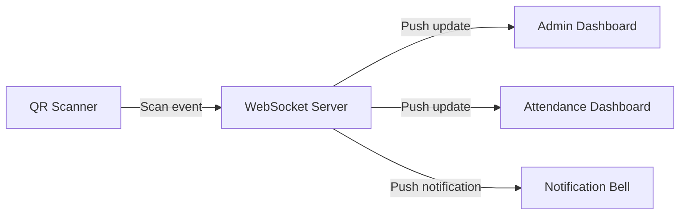
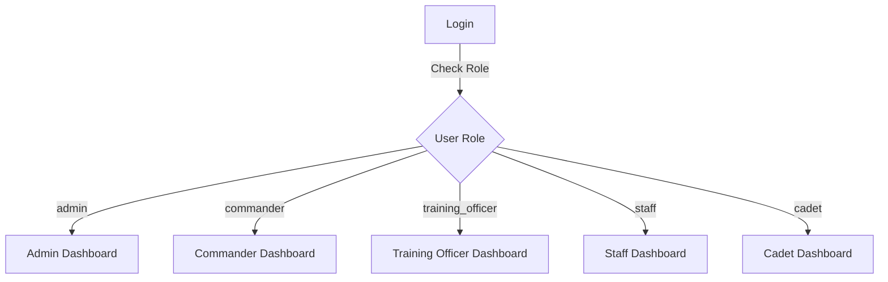
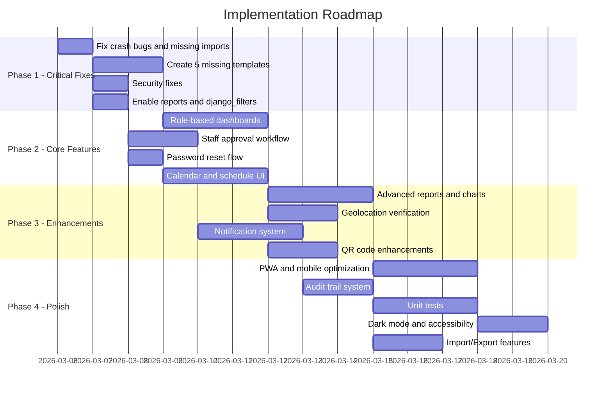

# MSRTSAMS — Recommendations: Fixes & New Features

---

## Part A: Fixes Required (Existing Bugs)

### Phase 1 — Critical Crash Fixes (Must Fix First)

| # | What to Fix | Where | How |
|---|-------------|-------|-----|
| 1 | Add missing `redirect` import | `apps/authentication/views.py` | Add `from django.shortcuts import render, redirect` |
| 2 | Add missing `timezone` import | `apps/staff/views.py` | Add `from django.utils import timezone` |
| 3 | Remove `created_by=request.user` | `apps/staff/views.py:140` | Remove the kwarg OR add `created_by` ForeignKey field to `TrainingStaff` model |
| 4 | Create 5 missing templates | `templates/` | Create `staff/list.html`, `staff/detail.html`, `attendance/dashboard.html`, `attendance/session_detail.html`, `reports/dashboard.html` |
| 5 | Enable reports URL route | `rotc_attendance/urls.py:29` | Uncomment the reports path |

### Phase 2 — Security Fixes

| # | What to Fix | Where | How |
|---|-------------|-------|-----|
| 6 | Remove `@csrf_exempt` from signup | `apps/authentication/views.py:233` | Remove decorator, use proper CSRF token in AJAX calls |
| 7 | Generate strong SECRET_KEY | `.env` | Use `python -c "from django.core.management.utils import get_random_secret_key; print(get_random_secret_key())"` |
| 8 | Fix bare `except:` | `apps/authentication/views.py:198` | Change to `except Exception as e:` with proper logging |
| 9 | Stop exposing internal errors | All views with `str(e)` | Return generic error messages, log details server-side |

### Phase 3 — Configuration Cleanup

| # | What to Fix | Where | How |
|---|-------------|-------|-----|
| 10 | Fix password double-hashing | `apps/authentication/serializers.py:35-41` | Use `User.objects.create_user` properly OR manual `set_password` only |
| 11 | Re-enable `django_filters` | `settings.py` + all ViewSets | Uncomment from `INSTALLED_APPS`, filter backends, and ViewSets |
| 12 | Consolidate duplicate serializer | `apps/qrcode/serializers.py` + `apps/attendance/serializers.py` | Keep one, import from single source |
| 13 | Delete orphaned Node.js files | `server.js`, `package.json` | Delete both OR refactor if Node.js proxy is intended |
| 14 | Fix redundant view branches | `apps/authentication/views.py` | Simplify `landing_view` and `dashboard_view` |
| 15 | Clean unused imports in urls.py | `apps/authentication/urls.py` | Remove `login_required`, `render`, `redirect`, `messages` |

---

## Part B: New Features to Add

### 1. Real-Time Attendance Dashboard with WebSocket

**Why:** The current dashboard is static and requires page refresh to see new attendance records.

**What to add:**
- Django Channels for WebSocket support
- Live attendance counter updating when QR codes are scanned
- Real-time notification when staff checks in
- Auto-refresh of session attendance lists

---

### 2. Proper Role-Based Dashboard Views

**Why:** Currently both admin and staff see the exact same `dashboard.html`. Different roles need different views.

**What to add:**
- **Admin Dashboard:** System overview, staff management shortcuts, QR code generation, full attendance stats, report generation
- **Commander Dashboard:** Unit-level attendance overview, staff performance metrics, schedule management
- **Training Officer Dashboard:** Session management, attendance taking, QR code usage
- **Staff Dashboard:** Personal attendance history, upcoming sessions, own QR code, profile management

---

### 3. Staff Registration Approval Workflow

**Why:** Currently anyone can register as staff with `is_active=True` — no verification.

**What to add:**
- New staff register but `is_active=False` by default
- Admin notification when new registration is pending
- Admin approval/rejection screen in staff management
- Email notification to staff when approved/rejected
- Registration token or invite-based signup option

---

### 4. Offline QR Code Scanning Support

**Why:** Military training often happens in remote areas with poor connectivity.

**What to add:**
- Progressive Web App (PWA) capabilities
- Service worker for offline QR scanning
- Local storage queue for offline scans
- Auto-sync when connectivity is restored
- Offline-capable attendance marking

---

### 5. SMS/Email Notification System

**Why:** Staff need to be notified about upcoming sessions, attendance status, and schedule changes.

**What to add:**
- Email notifications for: session reminders, schedule changes, attendance warnings
- SMS integration (via Twilio or similar) for critical alerts
- Notification preferences per user
- Daily/weekly attendance summary emails for commanders
- Low attendance warnings for staff members

---

### 6. Geolocation-Based Attendance Verification

**Why:** The model has `location_verified` field but no actual verification logic.

**What to add:**
- Define training session locations with GPS coordinates and radius
- Compare staff scan location with session location
- Flag scans that are outside the allowed radius
- Map visualization of where scans occurred
- Location mismatch alerts for admins

---

### 7. Advanced Reports & Analytics

**Why:** Reports app exists but is disabled, and analytics are basic.

**What to add:**
- **Attendance Trend Charts:** Line graphs showing attendance rates over time
- **Staff Performance Scorecards:** Individual metrics combining attendance + evaluations
- **Heat Map Calendar:** Visual daily attendance view
- **Comparative Reports:** Compare attendance across specializations, ranks, or time periods
- **Export to Google Sheets** integration
- **Scheduled Auto-Reports:** Weekly/monthly reports sent via email automatically
- **Dashboard Charts:** Chart.js or ApexCharts integration for visual analytics

---

### 8. QR Code Enhancements

**Why:** Current QR system is functional but can be enhanced for better security and usability.

**What to add:**
- **Dynamic QR codes** that rotate every N seconds on a projector during sessions
- **One-time-use personal QR codes** for each staff member (instead of session-based)
- **QR code PDF generation** for printing ID cards
- **Batch QR code generation** for all staff at once
- **QR code with embedded photo** for visual verification
- **Session check-out via QR** (currently only check-in)

---

### 9. Mobile App or PWA

**Why:** Mobile access is essential for a QR-based attendance system used in the field.

**What to add:**
- Progressive Web App with install prompt
- Push notifications for sessions
- Camera-native QR scanner
- Offline-first architecture
- Mobile-optimized dashboard
- Touch-friendly attendance marking

---

### 10. Audit Trail & Activity Logging

**Why:** Military systems require comprehensive logging.

**What to add:**
- Log all user actions: login, logout, data changes, report downloads
- Admin audit log viewer with filtering
- Track who modified what and when
- Export audit logs
- Alert on suspicious activity patterns like repeated failed logins
- IP-based access logging is partially there, expand to all actions

---

### 11. Calendar & Schedule Management

**Why:** `StaffSchedule` model exists but there's no UI for it.

**What to add:**
- Interactive calendar view (FullCalendar.js integration)
- Drag-and-drop schedule creation
- Session creation from calendar
- Color-coded events by session type
- Conflict detection when scheduling overlapping sessions
- iCal export for syncing with personal calendars

---

### 12. Import/Export Data Features

**Why:** For initial setup and data migration, bulk operations are needed.

**What to add:**
- **Bulk staff import** from CSV/Excel
- **Attendance import** from spreadsheet
- **Backup/Restore** database functionality
- **API export** for integration with other military systems

---

### 13. Password Reset & Account Recovery

**Why:** Currently there's no way for users to reset forgotten passwords.

**What to add:**
- Forgot password flow with email token
- Admin-initiated password reset
- Password change screen for logged-in users
- Password strength requirements display on signup
- Account lockout after N failed attempts

---

### 14. Unit Tests & Test Coverage

**Why:** There are zero tests in the project.

**What to add:**
- Unit tests for all models
- API endpoint tests for all views
- Authentication flow tests
- QR code generation/scanning tests
- Report generation tests
- Integration tests for end-to-end workflows
- CI/CD pipeline with test automation

---

### 15. Dark Mode & Accessibility

**Why:** Military personnel may use the system in various lighting conditions.

**What to add:**
- Dark mode toggle
- High contrast mode
- Screen reader compatibility
- Keyboard navigation support
- Larger font size option
- Fix the accessibility warning on button missing `title` attribute in `landing.html`

---

## Part C: Suggested Implementation Priority

---

## Summary

| Category | Count |
|----------|-------|
| **Critical bug fixes** | 5 |
| **Security fixes** | 4 |
| **Configuration cleanup** | 6 |
| **New features suggested** | 15 |
| **Total action items** | **30** |

The system has a solid foundation with good model design and a well-organized Django app structure. The main issues are completion gaps — missing templates, disabled modules, and import bugs that prevent the app from running end-to-end. Once the Phase 1 fixes are applied, the system will be functional, and the suggested features will transform it into a production-grade military attendance management system.
