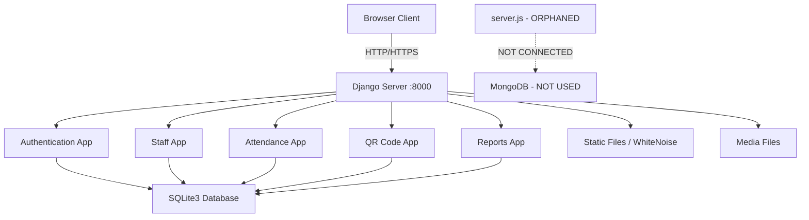
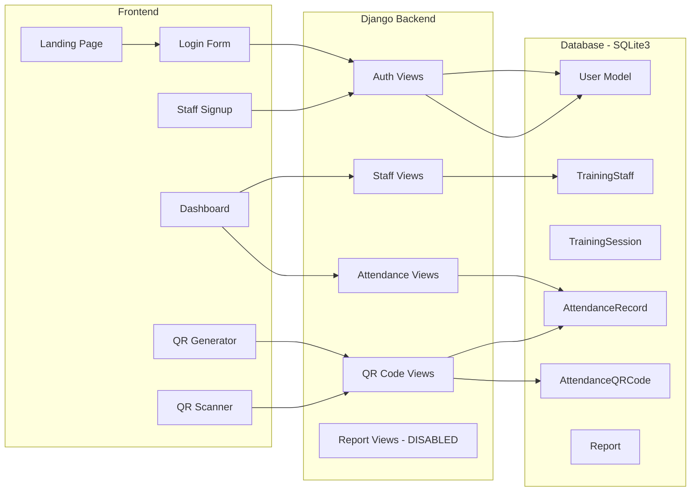

# MSU-SND ROTC Attendance Management System — Full System Audit

**Date:** 2026-03-05  
**Project:** MSRTSAMS (MSU-SND ROTC Training Staff Attendance Management System)  
**Stack:** Django 4.2.7 + Django REST Framework + Bootstrap 5 + jQuery  

---

## 1. System Architecture Overview



### App Responsibilities

| App | Purpose | Status |
|-----|---------|--------|
| `apps.authentication` | User model, login/logout, signup, dashboard | **Partially Working - has bugs** |
| `apps.staff` | Training staff profiles, qualifications, schedules | **Broken - missing imports and templates** |
| `apps.attendance` | Training sessions, attendance records, QR codes | **Broken - missing templates** |
| `apps.qrcode` | QR code generation, scanning, logging | **Working API, templates exist** |
| `apps.reports` | Report generation in PDF/Excel/CSV | **Disabled - URL route commented out** |

---

## 2. Critical Bugs Found

### 2.1 Missing `redirect` Import — [`apps/authentication/views.py`](apps/authentication/views.py)

The view uses `redirect()` on **3 lines** but never imports it:

- **Line 103**: `return redirect('authentication:login')` in [`staff_login_view()`](apps/authentication/views.py:103)
- **Line 136**: `return redirect('authentication:login')` in [`admin_login_view()`](apps/authentication/views.py:136)  
- **Line 215**: `return redirect('authentication:dashboard')` in [`staff_management_view()`](apps/authentication/views.py:215)

**Impact:** Any GET request to `/staff/login/`, `/admin/login/`, or unauthorized access to `/staff/management/` will crash with `NameError: name 'redirect' is not defined`.

**Fix:** Add `from django.shortcuts import render, redirect` at the top of the file.

---

### 2.2 Missing `timezone` Import — [`apps/staff/views.py`](apps/staff/views.py)

[`staff_detail()`](apps/staff/views.py:76) uses `timezone.now()` on line 76 but `timezone` is never imported.

**Impact:** Viewing any staff detail page will crash with `NameError: name 'timezone' is not defined`.

**Fix:** Add `from django.utils import timezone` to imports.

---

### 2.3 Non-existent `created_by` Field — [`apps/staff/views.py`](apps/staff/views.py:140)

[`create_staff_profile()`](apps/staff/views.py:136) passes `created_by=request.user` when creating a `TrainingStaff` object, but the [`TrainingStaff model`](apps/staff/models.py:8) has no `created_by` field.

**Impact:** API call to create staff profile crashes with `TypeError: TrainingStaff() got an unexpected keyword argument 'created_by'`.

**Fix:** Either add a `created_by` field to the model, or remove the `created_by=request.user` parameter.

---

### 2.4 Double Password Hashing — [`apps/authentication/serializers.py`](apps/authentication/serializers.py:35)

In [`UserRegistrationSerializer.create()`](apps/authentication/serializers.py:35):
```python
user = User.objects.create_user(**validated_data)  # Already hashes password
user.set_password(password)  # Double-hashes the password
user.save()
```

`create_user()` already hashes the password. Calling `set_password()` again on the raw password is redundant but not harmful — however if the intent was to pass password through `validated_data` to `create_user()`, the password was already popped out, so `create_user()` will fail or create a user with no password.

**Fix:** Replace with:
```python
validated_data.pop('password_confirm')
password = validated_data.pop('password')
user = User(**validated_data)
user.set_password(password)
user.save()
return user
```

---

### 2.5 Fragile RANK_CHOICES Access — [`apps/staff/views.py`](apps/staff/views.py:103)

Line 103: `TrainingStaff.objects.model.user.field.related_model.RANK_CHOICES` — This traverses the ORM meta layer unnecessarily.

**Fix:** Use `User.RANK_CHOICES` directly after importing the User model.

---

## 3. Missing Template Files

The following templates are referenced in views but **do not exist** in the `templates/` directory:

| Template Path | Referenced In | View Function |
|---------------|---------------|---------------|
| `staff/list.html` | [`apps/staff/views.py:67`](apps/staff/views.py:67) | `staff_list()` |
| `staff/detail.html` | [`apps/staff/views.py:84`](apps/staff/views.py:84) | `staff_detail()` |
| `attendance/dashboard.html` | [`apps/attendance/views.py:83`](apps/attendance/views.py:83) | `attendance_dashboard()` |
| `attendance/session_detail.html` | [`apps/attendance/views.py:96`](apps/attendance/views.py:96) | `session_attendance()` |
| `reports/dashboard.html` | [`apps/reports/views.py:59`](apps/reports/views.py:59) | `reports_dashboard()` |

**Impact:** Navigating to any staff, attendance, or report page will crash with `TemplateDoesNotExist`.

---

## 4. Configuration & Infrastructure Issues

### 4.1 Orphaned Node.js Server — [`server.js`](server.js)

[`server.js`](server.js) defines a complete Express.js server with MongoDB, referencing route files that **don't exist**:
- `./routes/auth`
- `./routes/staff`  
- `./routes/attendance`
- `./routes/qrcode`
- `./routes/reports`

[`package.json`](package.json) has Node.js dependencies like `express`, `mongoose`, `bcryptjs`, etc. that are unrelated to the Django app.

**Impact:** Running `node server.js` or `npm start` will crash. This is dead code from an abandoned architecture.

**Recommendation:** Delete `server.js` and clean `package.json`, OR if the intent was a Node.js proxy, create the missing route files.

---

### 4.2 Database Mismatch

| Source | Database |
|--------|----------|
| [`README.md`](README.md:30) | PostgreSQL |
| [`.env`](.env:4) | `DB_NAME=rotc_attendance`, `DB_HOST=localhost:5432` |
| [`requirements.txt`](requirements.txt:7) | `psycopg2-binary` (PostgreSQL driver) |
| [`settings.py`](rotc_attendance/settings.py:91) | **SQLite3** |

**Impact:** The `.env` PostgreSQL settings are completely ignored. The system uses SQLite instead. This is fine for development but breaks the deployment documentation.

---

### 4.3 Reports App Disabled — [`rotc_attendance/urls.py`](rotc_attendance/urls.py:29)

```python
# path('reports/', include('apps.reports.urls')),  # Temporarily disabled
```

The entire reports module is unreachable despite being fully coded.

---

### 4.4 `django_filters` Disabled Everywhere

`django-filter==23.5` is in [`requirements.txt`](requirements.txt:14) but:
- Commented out in [`settings.py`](rotc_attendance/settings.py:45) INSTALLED_APPS
- Commented out in [`settings.py`](rotc_attendance/settings.py:158) REST_FRAMEWORK filter backends
- Commented out in all ViewSets across staff, attendance, reports, and qrcode views

**Impact:** FilterSet fields defined on ViewSets like `filterset_fields = ['specialization', 'status']` do nothing.

---

## 5. Security Issues

### 5.1 Insecure SECRET_KEY — [`.env`](.env:1) / [`settings.py`](rotc_attendance/settings.py:25)

```
SECRET_KEY=django-insecure-your-secret-key-here-change-in-production
```

The default is a known insecure key. Must be changed before any deployment.

### 5.2 CSRF Exempt on Registration — [`apps/authentication/views.py`](apps/authentication/views.py:233)

```python
@csrf_exempt
def staff_signup_view(request):
```

The registration endpoint has CSRF protection disabled, enabling cross-site request forgery attacks against the signup form.

### 5.3 Bare Exception Handling — [`apps/authentication/views.py`](apps/authentication/views.py:198)

```python
except:
    return Response(...)
```

Swallows all exceptions, including `SystemExit` and `KeyboardInterrupt`. Should use `except Exception:`.

### 5.4 Unauthenticated Registration — [`apps/authentication/views.py`](apps/authentication/views.py:234)

`staff_signup_view()` allows anyone to create a user account with role `'staff'` and `is_active=True` without any approval workflow or CAPTCHA. In a military system, this is a significant security concern.

### 5.5 Error Messages Expose Internal Details

Multiple views return `str(e)` in error responses, which can leak internal file paths, database schema info, etc.

---

## 6. Code Quality Issues

### 6.1 Duplicate Serializer

[`AttendanceQRCodeSerializer`](apps/qrcode/serializers.py:17) is defined in **both**:
- `apps/qrcode/serializers.py`
- `apps/attendance/serializers.py`

They are nearly identical. The QR code view imports from `apps.qrcode.serializers`, and the attendance view imports from `apps.attendance.serializers`.

### 6.2 Unused Imports in URLs — [`apps/authentication/urls.py`](apps/authentication/urls.py:3)

```python
from django.contrib.auth.decorators import login_required
from django.shortcuts import render, redirect
from django.contrib import messages
```

These imports in `urls.py` are unused.

### 6.3 Redundant Dashboard Logic — [`apps/authentication/views.py`](apps/authentication/views.py:224)

```python
def dashboard_view(request):
    if request.user.role == 'admin':
        return render(request, 'dashboard.html')
    else:
        return render(request, 'dashboard.html')
```

Both branches render the same template.

### 6.4 `landing_view()` Same Pattern — [`apps/authentication/views.py`](apps/authentication/views.py:18)

```python
def landing_view(request):
    if request.user.is_authenticated:
        if request.user.role == 'admin':
            return render(request, 'dashboard.html')
        else:
            return render(request, 'dashboard.html')
    return render(request, 'landing.html')
```

Both admin/non-admin branches are identical.

### 6.5 Missing `login_required` on Staff Login View — [`apps/authentication/views.py`](apps/authentication/views.py:73)

The GET handler for [`staff_login_view()`](apps/authentication/views.py:73) calls `redirect('authentication:login')` instead of rendering a template, but this function is NOT the one mapped in templates — the template [`staff_login.html`](templates/authentication/staff_login.html) exists and works independently. The view just redirects, making its own template unused through the view path.

---

## 7. Data Flow Diagram



---

## 8. Summary of All Issues

### Critical - App Will Crash
| # | Issue | File | Line |
|---|-------|------|------|
| 1 | Missing `redirect` import | `apps/authentication/views.py` | 1, 103, 136, 215 |
| 2 | Missing `timezone` import | `apps/staff/views.py` | 76 |
| 3 | Non-existent `created_by` field | `apps/staff/views.py` | 140 |
| 4 | 5 missing template files | Multiple views | See Section 3 |
| 5 | Reports app URL disabled | `rotc_attendance/urls.py` | 29 |

### High - Security Vulnerabilities
| # | Issue | File | Line |
|---|-------|------|------|
| 6 | `@csrf_exempt` on registration | `apps/authentication/views.py` | 233 |
| 7 | Insecure default SECRET_KEY | `.env` | 1 |
| 8 | Unauthenticated open registration | `apps/authentication/views.py` | 234 |
| 9 | Internal error messages exposed | Multiple views | Various |

### Medium - Functionality Issues
| # | Issue | File | Line |
|---|-------|------|------|
| 10 | Double password hashing in serializer | `apps/authentication/serializers.py` | 35-41 |
| 11 | `django_filters` disabled everywhere | `settings.py` + all views | Various |
| 12 | Duplicate `AttendanceQRCodeSerializer` | Two serializer files | - |
| 13 | Orphaned `server.js` + `package.json` | Root | - |
| 14 | Database config mismatch SQLite vs PostgreSQL | `settings.py` vs `.env`/README | - |

### Low - Code Quality
| # | Issue | File | Line |
|---|-------|------|------|
| 15 | Bare `except:` clause | `apps/authentication/views.py` | 198 |
| 16 | Unused imports in `urls.py` | `apps/authentication/urls.py` | 3-5 |
| 17 | Redundant identical branches | `apps/authentication/views.py` | 22-25, 227-230 |
| 18 | Fragile `RANK_CHOICES` access pattern | `apps/staff/views.py` | 103 |

---

## 9. Recommended Fix Priority

1. **Add missing imports** (`redirect`, `timezone`) — prevents crash
2. **Remove `created_by` kwarg** from staff profile creation — prevents crash
3. **Create missing templates** (5 templates) — enables core pages
4. **Enable reports URL** — re-enables full reports functionality
5. **Fix `UserRegistrationSerializer`** — prevents auth issues
6. **Re-enable `django_filters`** or remove dependency — reduces confusion
7. **Remove `@csrf_exempt`** from signup — security fix
8. **Fix bare `except:` clause** — proper error handling
9. **Clean up orphaned Node.js files** — reduces confusion
10. **Generate proper SECRET_KEY** — security hardening
11. **Align database configuration** — documentation accuracy
12. **Add registration approval workflow** — security improvement
